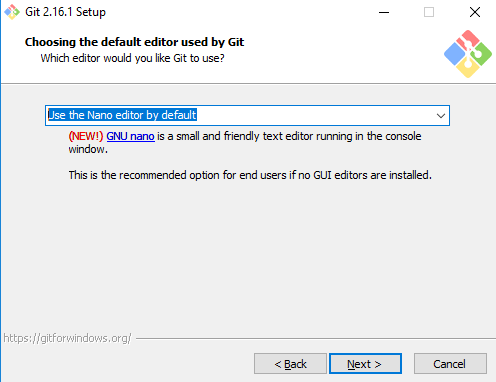

# Instalación y configuración de Git/Github.

* ¿Qué es Git?
>  Hoy en día, Git es, con diferencia, el sistema de control de versiones moderno más utilizado del mundo. Git es un proyecto de código abierto maduro y con un mantenimiento activo que desarrolló originalmente Linus Torvalds, el famoso creador del kernel del sistema operativo Linux, en 2005. Así pues, Git es uno de estos sistemas de control, que permite comparar el código de un archivo para ver las diferencias entre las versiones, restaurar versiones antiguas si algo sale mal, y fusionar los cambios de distintas versiones.

* ¿Qué es GitHub?
> GitHub es un sitio "social coding". Te permite subir repositorios de código para almacenarlo en el sistema de control de versiones Git. Tu puedes colaborar en proyectos de código, y el sistema es código abierto por defecto, lo que significa que cualquiera en el mundo puede encontrar tu código en GitHub, usarlo, aprender de el, y mejorarlo. ¡Tú puedes hacer eso con el código de otras personas tambien!

* [Instalación Windows](#id1)
* [Instalación Linux](#id2)
* [Configuración](#id3)
* [SSH-Keys Windows](#id4)
* [SSH-Keys Linux](#id5)
* [Comandos básicos](#id6)

## Instalación de Git.

* **Para sistemas Windows:**

Accederemos a https://gitforwindows.org/ y clickaremos en "Download".
Una vez lo tengamos descargado, procederemos con la instalación.

Nos solicitará la carpeta de instalación, que la elegiremos a nuestro gusto. En el resto del setup, es importante que sigamos los siguientes pasos:

Posteriormente en mi caso, elijo el editar Nano por defecto.

Marcamos también la opción de utilizar Git desde la CMD.

El resto de la instalación podemos dejarla con el valor por defecto.

Una  vez finalizada la instalación, utilizaremos el programa **Git Bash** que tendremos recién instalado.

* **Para sistemas Linux:**

Abriremos la consola y, primero actualizaremos los repositorios y posteriormente instalamos Git.

~~~ 
sudo apt-get update
sudo apt-get install git
~~~

## Configuración

Ahora iremos a https://github.com/ y nos creamos una cuenta personal.
Luego, abrimos Git Bash en Windows o la terminal en Linux y ejecutaremos lo siguiente:

~~~
git config --global user.name "nombre_usuario" // Nombre de nuestro user en github
git config --global user.email "email" // Email de nuestro user en github
git config --global push.default simple
~~~

## SSH Keys

* **Para sistemas Windows**:

Abrimos Git Bash e introducimos:

~~~
ssh-keygen -t ed25519 -C "email" // Email de nuestro user en github
~~~
Si nos da error por no soportar el algoritmo ED25519 ejecutamos el siguiente:
~~~
ssh-keygen -t rsa -b 4096 -C "email"
~~~

Nos aparecerá el siguiente mensaje, al cual damos "Enter".

~~~
> Enter a file in which to save the key (/c/Users/you/.ssh/id_algorithm):[Press enter]
~~~

Por último, introduciremos una contraseña:
~~~
> Enter passphrase (empty for no passphrase): [Type a passphrase]
> Enter same passphrase again: [Type passphrase again]
~~~

Ahora, copiamos la key generada.

~~~
clip < ~/.ssh/id_ed25519.pub
~~~

Iremos a nuestro perfil de Github, y luego **Settings > SSH Keys > New SSH Key**

En título, pondremos por ejemplo "SSH Key de nuestro PC." y en KEY copiaremos la clave anteriormente copiada.

* **Para sistemas Linux**

Abrimos una terminal y ejecutamos:
~~~
 ssh-keygen 
~~~

Ahora, situados en el directorio raíz, ejecutaremos lo siguiente en este orden:
~~~
cd .ssh/
cat id_rsa.pub
~~~

Copiaremos el contenido del archivo `id_rsa.pub`

Iremos a nuestro perfil de Github, y luego **Settings > SSH Keys > New SSH Key**

En título, pondremos por ejemplo "SSH Key de nuestro PC." y en KEY copiaremos la clave anteriormente copiada.

## Comandos básicos.

* Para clonar un repositorio, iremos a cualquiera de los que tengamos creados y en `CODE`:

Copiaremos la salida SSH y ejecutamos:
~~~
git clone "git@github.com:adanpg5/VirtualBox.git" // Este es el ejemplo de mi repositorio
~~~

* `git status` - Comprobamos si tenemos ficheros por actualizar.
* `git add fichero` - Añadimos el archivo modificado o generado.
* `git commit -m "accion"` - Realizamos el commit añadiendo el comentario de lo que hemos realizado.
* `git push` - Subimos el archivo a Github.
* `git pull` - Actualizar la carpeta local según los archivos de Github.
* `git init` - Crea un nuevo repositorio de Git.
